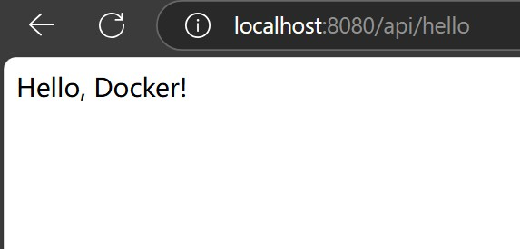

# Docker介绍与使用

## 介绍
docker可以将程序与环境打包成一个容器，在任何平台都可以直接使用，无需重新配置环境。只能在linux环境运行，所以windows系统的docker底层运行在虚拟机上
作用：无需配置、镜像复用、便于管理。
名词介绍：
docker客户端（docker client）：负责与服务端交互，管理容器和镜像等
docker服务端（docker deamon）：接收服务端的指令来管理容器和镜像
docker仓库：仓库用于存储和管理镜像，可分享或拉取镜像
镜像：一个只读的模版，用于创建容器
容器：docker的运行实例，提供一个独立可移植的环境来运行程序
Dockerfile：包括依赖、环境和运行应用程序需要的所有指令，用于创建镜像
他们之间的关系如图：

## 使用
1.官网下载安装docker程序
2.使用docker命令或点击docker desktop启动docker，使用docker version查看，有client与server说明docker已启动
3.在项目根目录创建Dockerfile，这里的项目可以是前后端及其他语言项目
4.编写Dockerfile文件
示例：

FROM openjdk:17-jdk-slim  
WORKDIR /app  
COPY target/docker-demo-0.0.1-SNAPSHOT.jar app.jar  
CMD ["java", "-jar", "app.jar"]
这里，
	FROM：程序运行的环境和依赖
	WORKDIR：设置工作目录，下面所有的路径都在这个工作目录下
	COPY：将本地程序拷贝到工作目录下，本地路径+目标路径
	CMD：容器执行的命令，这里同java -jar app.jar，但遇到OS信号时有问题，所以官方推荐使用json数组的格式

6.项目根目录终端执行docker build -t my-java-app .构建镜像。镜像会存储在
	 -t my-java-app表示指定镜像名称为my-java-app，-t是--tag的意思
	可在名称后使用：追加版本号，默认是latest
	“.”表示当前路径，选择Dockerfile所在路径
7.镜像源，这里应该会执行失败，因为Docker hub被限制了，国内很多镜像源也失效，自测可用的镜像源是https://hub.littlediary.cn，在docker desktop的Docker Engine中配置即可
8.运行镜像，创建容器同时执行指令。
可先用docker images查看镜像是否创建成功。
运行docker run -d -p 8080:8080 --name java-container my-java-app命令创建容器。
	-d 表示在后台运行，让容器输出不显示在控制台。
	-p表示从主机到容器的端口映射。
	--name java-container表示指定容器名称为java-container。
	my-java-app为刚才创建的镜像
9.此时程序便运行在后台的容器中，可以从浏览器访问链接得到响应。
示例：

## 后续管理容器命令：
查看运行中容器
doker ps
停止容器
docker stop java-container
删除容器
docker rm java-container
删除镜像
docker rmi my-java-app
进入容器内部（类似于进入远程服务器，可调试、排查问题、执行命令）
docker exec -it java-container sh
查看日志
docker logs java-container
查看容器详细信息，包括镜像名、工作路径、执行命令、端口号、IP等
docker inspect java-container

## 镜像的复用：
登录私有仓库
docker login harbor.mycompany.com
给镜像打tag（仓库地址+项目名+镜像名，便于管理）
docker tag my-java-app harbor.mycompany.com/myproject/my-java-app:1.0
推送到仓库
docker push harbor.mycompany.com/myproject/my-java-app:1.0
拉取镜像
docker pull harbor.mycompany.com/myproject/my-java-app:1.0

## 关于Docker的虚拟机：
当使用以上方法安装时，默认会在C:\Users\用户名\AppData\Local\Docker\wsl路径下安装一个wsl2的虚拟机，想使用额外的虚拟机可在docker客户端Settings->Resources->WSL integration里勾选使用
